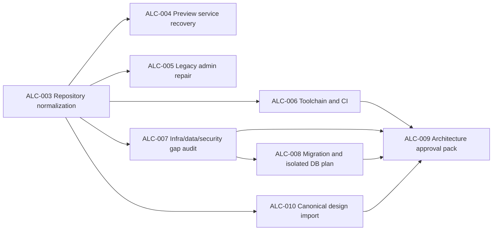

# Remediation Execution Roadmap

Task: ALC-003 update. The roadmap remains gated; ALC-003 is completed locally without push or production mutation.

## Dependency sequence

Recommended operational priority is ALC-003, then the two P0 risk lanes ALC-004 and ALC-005 under separate approvals. ALC-006 and the read-only portion of ALC-007 can proceed in parallel worktrees after ALC-003.

## ALC-003 — SAFE REPOSITORY NORMALIZATION

Status 2026-07-14: **COMPLETED LOCALLY; G1 PARTIAL**.

- Goal: convert the local recovered baseline into an approved durable clean repository source of truth without cleaning production.
- Dependencies: ALC-002 documents; G0 PASS.
- Allowed paths: repository metadata/docs, explicit baseline source paths, approved remote branch; production read-only comparison.
- Forbidden: production reset/clean/build, runtime JSON, secrets, legacy deletion, route/service changes.
- Risk: HIGH because an incorrect path decision can lose the only source/state distinction.
- Expected artifacts: reviewed path manifest, duplicate consumer inventory, approved `.gitignore`, remote baseline ref, clean-clone proof.
- Acceptance: all source tracked; banned runtime/generated/secret scan zero; 23 duplicate groups classified; clean clone reproduces checks; production status/hash unchanged.
- Parallel: first task; no overlapping repository normalization.
- Result: clean normalization branch, read-only hygiene check, explicit duplicate retention, source-control metadata normalization, required checks and fresh-checkout build PASS. Runtime migration and remote publication were intentionally deferred.
- Gate: advances G1 but does not close it; remote durability and runtime-consumer gaps remain.

## ALC-004 — PERMANENT PREVIEW SERVICE RECOVERY

- Goal: activate an immutable preview release through a permanent, restart-safe service without public production route migration.
- Dependencies: ALC-003/G1 and explicit operations authorization; recovered artifact.
- Allowed paths: release/service/runbook files explicitly approved by operations.
- Forbidden: allchemist/admin/API public route changes, backend/DB restart, source build in production, removal of current release before rollback proof.
- Risk: HIGH; touches preview service continuity.
- Expected artifacts: service definition, release selector, health check, logs, restart and rollback report, access decision.
- Acceptance: cold boot/restart passes, current routes/services remain unchanged, rollback rehearsal passes.
- Parallel: can be developed in parallel after ALC-003, but production activation requires exclusive operations window.
- Gate: closes G3.

## ALC-005 — CRITICAL LEGACY ADMIN REPAIR

- Goal: repair the confirmed duplicate declaration without changing admin behavior/contracts.
- Dependencies: ALC-003; protected legacy backup; focused test plan.
- Allowed paths: explicit `web_admin` source/test/docs in an isolated worktree.
- Forbidden: target admin implementation, route switch, RBAC/payment/license behavior changes, production direct edit.
- Risk: HIGH due privileged current UI.
- Expected artifacts: minimal diff, syntax proof, critical workflow regression, release/rollback artifact.
- Acceptance: `node --check` passes; focused tests/E2E pass; admin HTTP/workflows and scopes remain valid.
- Parallel: isolated implementation can run beside ALC-006/007; release is serialized with operations.
- Gate: closes G4.
- ALC-005 implementation evidence: source repair and isolated validation complete on `fix/alc-005-legacy-admin-javascript-20260718-124731`; approved integration/release and G4 production evidence remain separate.

## ALC-006 — SAFE TOOLCHAIN AND CI

- Goal: separate check/test/build/smoke/deploy effects and gate target source in clean CI.
- Dependencies: ALC-003/G1.
- Allowed paths: tools, package scripts, CI workflows, quality docs/tests.
- Forbidden: production build/run, dependency upgrades without separate approval, production credentials/state.
- Risk: MEDIUM.
- Expected artifacts: guarded commands, output ownership, CI jobs, side-effect tests, lint decision.
- Acceptance: clean CI covers target typechecks/tests/build/reference checks; read-only modes produce zero diff; mixed tool cannot run in production cwd.
- Parallel: YES after ALC-003.
- Gate: closes G2.

## ALC-007 — INFRASTRUCTURE, DATA AND SECURITY GAP AUDIT

- Goal: verify open infrastructure/storage/auth/RBAC/tenant/secrets/audit/observability/notification questions without mutation.
- Dependencies: ALC-003; authorized read-only access for any sensitive attestation.
- Allowed paths: planning reports and redacted read-only inventories.
- Forbidden: exposing values, provisioning Redis/object storage/queue/observability, schema or live config changes.
- Risk: MEDIUM/HIGH for sensitive evidence handling.
- Expected artifacts: verified gap report, state reader/writer map, redacted config ownership, security/tenant test plan, ADR evidence.
- Acceptance: NEEDS_VERIFICATION items become confirmed/open or disproven with evidence; no secrets/payloads reported.
- Parallel: read-only lanes may run with ALC-004/005/006 after ALC-003.
- Gate: advances G6/G7; does not alone close them.

## ALC-008 — DATABASE MIGRATION AND ISOLATED TEST ENVIRONMENT PLAN

- Goal: establish schema baseline, migration framework design, isolated DB tests, backup/restore rehearsal plan.
- Dependencies: ALC-007 data/security findings and G1/G2.
- Allowed paths: migration/test/architecture docs and isolated non-production fixtures when separately authorized.
- Forbidden: production migrations/writes, production pytest, destructive restore.
- Risk: HIGH.
- Expected artifacts: schema baseline, ADR-001 decision, revision/bootstrap strategy, test DB guard, migration/rollback/restore runbooks.
- Acceptance: isolated forward/rollback/restore design is executable and covers tenant/auth/content invariants; actual execution is a separately scoped gate task if not included.
- Parallel: planning can overlap ALC-010; database rehearsal requires dedicated environment.
- Gate: prepares/closes G5 only when execution evidence exists.

## ALC-009 — TARGET ARCHITECTURE APPROVAL PACK

- Goal: turn proposed bounded contexts and ADR backlog into owner-approved decisions and implementation contracts.
- Dependencies: ALC-003, ALC-006, ALC-007, ALC-008 planning, and required ALC-010 design evidence.
- Allowed paths: architecture/ADR/contracts/ownership documents.
- Forbidden: feature implementation, schema/service/route changes, legacy deletion.
- Risk: MEDIUM.
- Expected artifacts: accepted/rejected ADRs, dependency rules, API/data/security contracts, migration sequence, workstream charters.
- Acceptance: owners approve boundaries and open decisions; scoped capabilities have G9 entry criteria.
- Parallel: ADR review can overlap design import, but final approval waits for blockers.
- Gate: closes G7 and enables scoped G9 evaluation.

## ALC-010 — CANONICAL DESIGN DOCUMENT AND REFERENCE IMPORT

- Goal: import approved design documents/references with provenance and canonical hashes.
- Dependencies: ALC-003/G1 and design/product owner input.
- Allowed paths: approved-reference manifest, canonical design storage, provenance docs, read-only checker.
- Forbidden: UI implementation, generated screenshot substitution, legacy visual copying, unapproved reference invention.
- Risk: MEDIUM due provenance and visual source of truth.
- Expected artifacts: seven missing references or explicit approved exceptions, hashes/dimensions/source/owner, asset duplicate decisions.
- Acceptance: all critical references present; manifest checker passes; provenance complete; generated artifacts distinct.
- Parallel: YES after ALC-003; may run beside ALC-007/008.
- Gate: closes G8.

## Parallel-safety matrix

| Task | Parallel after ALC-003 | Shared-risk lock |
|---|---|---|
| ALC-004 | implementation prep YES | exclusive preview operations activation |
| ALC-005 | YES in separate worktree | legacy release window |
| ALC-006 | YES | shared package scripts/CI ownership |
| ALC-007 | YES, read-only lanes | sensitive evidence access |
| ALC-008 | planning YES | isolated DB environment |
| ALC-009 | ADR review YES | final cross-owner approval |
| ALC-010 | YES | design manifest/canonical asset ownership |

## ID decision

The requested ALC-003 through ALC-010 IDs remain stable. No renumbering is recommended. Large implementation work after ALC-009 should receive new IDs rather than expanding these planning/remediation tasks.

## Next execution recommendation after ALC-003

1. ALC-004 is the next operational priority because preview 3010 still runs from a deleted cwd. It requires explicit operations authorization and no public route switch.
2. ALC-005 may repair the legacy-admin P0 in a separate worktree with focused rollback evidence.
3. ALC-006 may integrate the read-only hygiene command into clean CI and repair mixed-side-effect tooling.
4. ALC-007 may perform read-only runtime/security ownership decisions; ALC-008 owns any later isolated migration/restore work.
5. No production change, screen development, duplicate deletion, or legacy removal is authorized by ALC-003.
