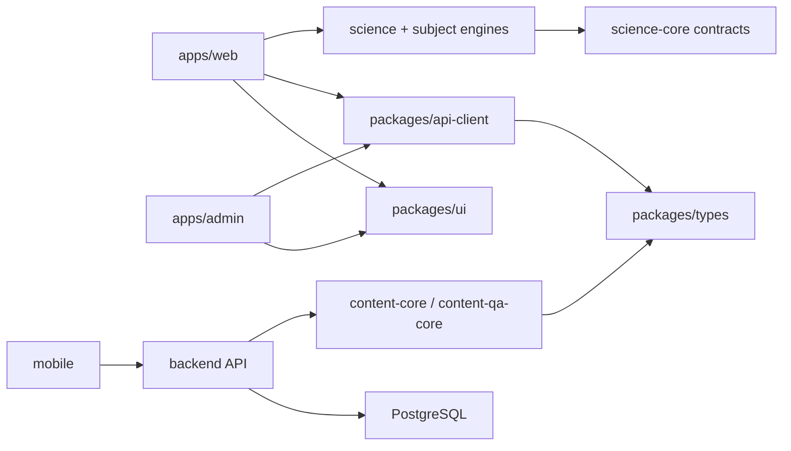

# Repository Target Layout

Task: ALC-002. This document describes ownership boundaries, not an immediate move.

## Repository source tree

```text
/
  apps/
    web/                 public/student/teacher web delivery
    admin/               privileged administration UI
  backend/               current FastAPI service until an approved apps/api decision
  mobile/                current Expo/React Native app until an approved apps/mobile decision
  packages/
    types/
    api-client/
    design-tokens/
    ui/
    ai-assistant/
    content-core/
    content-qa-core/
    progress-core/
    science-core/
    chemistry-core/
    chemistry-lab-engine/
    physics-core/
    physics-sim-engine/
    biology-core/
    microscope-viewer/
  content/               versioned, source-backed content inputs
  tools/                 explicitly classified development/quality tools
  infra/                 desired-state templates and non-secret schema/bootstrap source
  docs/                  ADRs, architecture, quality, design provenance, runbooks
  .github/workflows/     clean-environment validation only
```

The `AGENTS.md` target mentions future `apps/api`, `apps/mobile`, and additional packages. Their creation is an ADR, not an ALC-002 decision. Existing `backend` and `mobile` paths remain canonical until an approved migration.

## Non-repository roots

```text
/var/lib/allchemist/ or approved equivalent/
  runtime/               mutable non-secret state when PostgreSQL is not suitable
  secure/                restricted security state
  logs/                  service logs with retention/redaction

/root/allchemist-runtime/preview/releases/<release-id>/
  immutable preview artifacts

/root/backups/allchemist/<task-or-date>/
  protected evidence and recovery archives

external approved services/
  PostgreSQL             durable relational source of truth
  Redis                  optional ephemeral cache/session/rate/job coordination only after ADR
  object storage         versioned media/releases/archives after ADR
  observability          redacted errors, metrics, traces, logs after ADR
```

Exact runtime paths, users, and permissions require operations/security approval.

## Current-to-target mapping

| Current path/state | Target class | Future location/owner | Constraint |
|---|---|---|---|
| `backend/app` | source | repository Backend lane | preserve API/auth behavior |
| `backend/app/web_public` | active legacy | repository Legacy lane | retain until G10 |
| `backend/app/web_admin` | active legacy | repository Legacy lane | repair under ALC-005; retain until G10 |
| `apps/web` | target source | Web lane | no public switch before G10 |
| `apps/admin` | target source | Admin lane | privileged gate G6/G9 |
| `mobile` | mobile source | Mobile lane | offline/storage ADR required |
| `backend/data` | mutable runtime/security | PostgreSQL, secure runtime, or audit store | no move before G5/G6 |
| content pack source | source | Content lane | provenance and QA required |
| mutable APK pointer | release runtime metadata | versioned object storage/runtime location | never product source |
| `.next`, dependencies, tsbuildinfo | generated | CI/worktree output | never canonical source |
| Playwright screenshots | test evidence | CI artifact storage | retention and route/build identity |
| approved golden PNG | canonical design input | manifest-owned source or approved design storage | provenance/hash required |
| release artifact | immutable deployment output | release root | source commit and checksum manifest |
| live nginx/systemd | operational desired state | operations-owned deployment source after audit | repository examples are not automatically live truth |

## Dependency direction



Rules:

- apps may depend on shared packages; packages never depend on apps;
- UI cannot import backend implementation;
- subject engines depend on science contracts, not web/admin;
- content publication is backend-owned and QA-gated;
- API client depends on contracts, not UI;
- infrastructure does not become a runtime dependency of product packages;
- legacy code cannot be imported into target UI as a visual component.

## Generated/release boundary

A clean checkout must contain only source and canonical versioned assets. A build writes to its own workspace. Promotion copies an immutable artifact with:

- source commit;
- tool/runtime versions;
- build commands;
- BUILD_ID;
- checksums;
- required environment variable names without values;
- startup and health commands;
- rollback target.

Production checkout must not be the build workspace or mutable artifact store.

## ALC-003 normalization evidence

The normalization branch keeps the current path layout; no mass move occurred. `apps/web`, `apps/admin`, `backend`, `mobile`, `packages`, `content`, `docs`, `tools`, and `infra` remain source roots. `artifacts`, build output, dependencies, runtime data, dumps and secrets are outside the tracked set. The fresh detached checkout at source commit `13e07a5` installed and built without any file from `/root/synapse` and ended with zero tracked or untracked non-ignored status.

The target layout remains a plan rather than authorization to create `apps/api`, move `backend`/`mobile`, migrate runtime data, or remove legacy. The tracked 14,341,981-byte chemistry content JSON remains in place pending ALC-010 provenance/large-file review; it was not misclassified as generated output.
