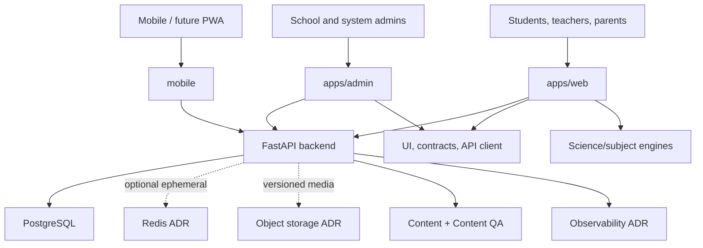

# Target Architecture Plan

Task: ALC-002. Status: proposed, not approved and not deployed.

## Principles

- Preserve current backend contracts and legacy behavior until gated migration.
- Apps compose user experiences; packages own reusable contracts/domain logic.
- PostgreSQL is the current durable runtime; new stores require ADRs and migration proof.
- Auth, RBAC, tenant, content publication, and audit are server-enforced boundaries.
- Scientific engines are deterministic, source-backed, and UI-independent.
- AI output is draft-only until Content QA approves publication.
- Build and release artifacts are immutable products of clean commits.

## Bounded contexts

### 1. apps/web

- Responsibility: public, student, teacher, and parent web journeys; rendering and client orchestration.
- Owned entities: view models and route-local UI state, never authoritative domain entities.
- APIs/events: typed `api-client` calls; auth/session and domain events consumed from backend.
- Storage: browser session/PWA storage only after ADR; no direct DB.
- Dependencies: UI, design tokens, API client, assistant and science view adapters.
- Prohibited: backend imports, secrets, direct tenant/permission decisions, demo data in production mode.
- Security/tenant: server identity is authoritative; UI hides nothing as a security control.
- Tests: typecheck, component/adapter tests, contract tests, Playwright, approved visual parity.
- Deployment: independent immutable Next artifact; route switch only G10.

### 2. apps/admin

- Responsibility: privileged system/school administration workflows.
- Owned entities: admin view models, filters, confirmations; no direct persistence.
- APIs/events: admin API-client scopes and audit-result events.
- Storage: minimal browser state; no provider credentials or durable admin data.
- Dependencies: UI, design tokens, types, API client.
- Prohibited: direct DB, client-authoritative RBAC/tenant scope, shared secret handling.
- Security/tenant: deny-safe server policy; destructive operations audited.
- Tests: role/scope matrix, negative E2E, tenant isolation, audit, visual references.
- Deployment: separate artifact/service; legacy admin retained until G10.

### 3. Backend / API

- Responsibility: authoritative business rules, APIs, auth, access, tenant scope, publication, integrations.
- Owned entities: users/sessions, schools/memberships, access grants, content workflow, tasks/progress, audit indexes.
- APIs/events: versioned HTTP API; future internal/domain events require ADR.
- Storage: PostgreSQL authoritative; approved cache/object/audit services via adapters.
- Dependencies: DB/integration adapters, not frontend packages.
- Prohibited: serving target UI business logic from mutable files; trusting client permissions/scope.
- Security/tenant: central enforcement, secret provider boundary, audit on privileged transitions.
- Tests: unit, contract, isolated DB integration, migration, adversarial tenant/RBAC.
- Deployment: container/release tied to schema compatibility and rollback.

### 4. Mobile / future PWA

- Responsibility: device experience, offline read/cache, sync, notifications, platform lifecycle.
- Owned entities: device-local projections and queued client events, not server authority.
- APIs/events: typed backend calls, sync protocol, notification receipts.
- Storage: SQLite/AsyncStorage only under ADR-defined schema/retention/encryption.
- Dependencies: mobile navigation/UI, API contracts, shared scientific/content formats.
- Prohibited: embedded provider secrets, permanent divergence from server, silent conflict resolution.
- Security/tenant: secure token storage, device revocation, tenant revalidation after sync.
- Tests: migration fixtures, offline/online conflicts, notification consent, device release matrix.
- Deployment: app-store/version compatibility; PWA relationship remains ADR.

### 5. packages/design-tokens

- Responsibility: approved colors, typography, spacing, motion/accessibility tokens.
- Owned entities: versioned token names/values and themes.
- APIs/events/storage: compile-time exports; no runtime persistence/events.
- Dependencies: none beyond language tooling.
- Prohibited: feature logic, domain facts, API access.
- Security/tenant: none; tokens cannot encode role policy.
- Tests: typecheck, schema/contrast checks, approved design comparison.
- Deployment: consumed into app builds.

### 6. packages/ui

- Responsibility: accessible product primitives and shared layouts.
- Owned entities: components and interaction contracts.
- APIs/events: typed callbacks; no direct backend calls.
- Storage: none beyond ephemeral component state.
- Dependencies: design tokens and generic types only.
- Prohibited: domain persistence, tenant/auth decisions, legacy visual copying.
- Security/tenant: render provided capability state; never enforce permissions alone.
- Tests: component states, accessibility, keyboard/responsive behavior, visual contracts.
- Deployment: library source bundled by apps.

### 7. packages/api-client

- Responsibility: typed HTTP transport, auth/session handling contract, error normalization.
- Owned entities: DTO mappings, request/response types, client errors.
- APIs/events: backend API v1 and future explicitly versioned endpoints.
- Storage: token/cookie adapter interface only; no hardcoded persistence.
- Dependencies: `packages/types`; no UI/app dependency.
- Prohibited: business authorization, hidden retries for non-idempotent writes, secret defaults.
- Security/tenant: credential redaction; server scope remains authoritative.
- Tests: contract fixtures, HTTP failures, refresh/revocation, idempotency behavior.
- Deployment: versioned with consumers and backend compatibility.

### 8. packages/ai-assistant

- Responsibility: assistant UI/state contracts and provider-neutral orchestration boundary.
- Owned entities: conversation state, draft answer metadata, citations/safety states.
- APIs/events: backend AI mentor API; draft/review events.
- Storage: server-owned conversation/audit decision pending ADR; no provider key in client.
- Dependencies: types/content source contracts; UI adapters only at app boundary.
- Prohibited: direct provider credentials, publishing generated facts, subject-engine mutation.
- Security/tenant: tenant/user context server-bound; prompt/output redaction and audit.
- Tests: provider failure/timeout, citation requirement, unsafe/unverified output states.
- Deployment: backend provider adapter plus client package; quality gate separate from health HTTP.

### 9. packages/content-core

- Responsibility: content entities, versioning, provenance, lifecycle contracts.
- Owned entities: content item/block/source/version and publication state.
- APIs/events: draft/validate/submit/version transitions.
- Storage: backend PostgreSQL and versioned assets through approved adapters.
- Dependencies: generic types/source contracts; not UI.
- Prohibited: direct publish bypass, provider secrets, subject simulation rendering.
- Security/tenant: editor/publisher separation and tenant/content ownership.
- Tests: state machine, provenance, version rollback, schema compatibility.
- Deployment: backend-owned publication semantics; packages shared for contracts.

### 10. packages/content-qa-core

- Responsibility: review queue, evidence, scientific validation, approve/reject gates.
- Owned entities: QA case/event/finding/decision.
- APIs/events: submit, claim, review, reject, approve, publication-block events.
- Storage: durable append/audit records in backend-approved store.
- Dependencies: content and science contracts.
- Prohibited: silent auto-approval, mutable audit erasure, client-only enforcement.
- Security/tenant: reviewer scopes, separation of duties, immutable evidence.
- Tests: negative publication, role separation, concurrent review, audit retention.
- Deployment: blocks publication regardless of UI availability.

### 11. packages/science-core

- Responsibility: cross-subject units, evidence/source, simulation state and deterministic contracts.
- Owned entities: quantities, units, citations, scenario/input/output envelopes.
- APIs/events: pure functions/contracts; optional engine lifecycle events.
- Storage: none; content inputs are versioned elsewhere.
- Dependencies: no app/UI; subject cores depend on it.
- Prohibited: subject-specific assumptions in shared contracts, random unseeded effects.
- Security/tenant: no tenant state; safe content metadata required.
- Tests: units, determinism, validation, serialization/property tests.
- Deployment: library bundled by engines/apps.

### 12. Chemistry

- Responsibility: chemistry entities/reactions and lab simulation engine.
- Owned entities: substances, reactions, conditions, hazards, observations, lab state.
- APIs/events: source-backed scenario input and deterministic observation/output events.
- Storage: versioned content; user progress through backend, not engine.
- Dependencies: science-core and chemistry-core; renderer via adapter.
- Prohibited: invented color/gas/precipitate/smell, UI navigation, auth.
- Security/tenant: safety metadata mandatory; no user data in engine.
- Tests: conservation/conditions/observations, deterministic steps, scientific review.
- Deployment: lazy module; fallback for unsupported graphics.

### 13. Physics

- Responsibility: physics quantities/scenarios and simulation state.
- Owned entities: bodies, forces, parameters, constraints, outputs.
- APIs/events: deterministic step/reset/measure events.
- Storage: versioned scenarios; progress via backend.
- Dependencies: science-core and physics-core.
- Prohibited: frame-rate-dependent truth, UI/auth/content publication.
- Security/tenant: no tenant state.
- Tests: equations/units/invariants/determinism and reviewed fixtures.
- Deployment: lazy engine/renderer with capability fallback.

### 14. Biology / microscope

- Responsibility: biological specimen/content contracts and microscope interaction state.
- Owned entities: specimen, layers, magnification, focus, annotations.
- APIs/events: load specimen, focus/magnify/annotate and observation events.
- Storage: versioned media/content; progress via backend.
- Dependencies: science-core, biology-core, microscope-viewer.
- Prohibited: generated unsupported labels/facts, auth/navigation.
- Security/tenant: licensed media/provenance; no user data in viewer.
- Tests: bounds/state transitions, label/source fixtures, accessibility fallback.
- Deployment: media/object-storage decision and lazy viewer.

### 15. Progress and assignments

- Responsibility: learning progress, attempts, assignment lifecycle and grading contracts.
- Owned entities: progress record, task, submission, attempt, grade, due-state.
- APIs/events: assigned/submitted/graded/completed/synced events.
- Storage: PostgreSQL authoritative; offline projection via mobile ADR.
- Dependencies: user/tenant/content identifiers and backend policies.
- Prohibited: client-authoritative grades/progress, cross-tenant lookup.
- Security/tenant: student/teacher/school scopes and audit.
- Tests: state machine, retries/idempotency, late/resubmit, tenant negatives.
- Deployment: schema/migration gate G5 before implementation changes.

### 16. Infrastructure

- Responsibility: desired-state templates, networking, service identity, storage, backup, rollout.
- Owned entities: service/release definitions and non-secret configuration schema.
- APIs/events: health/readiness/metrics and deployment events.
- Storage: infrastructure state outside product Git where appropriate.
- Dependencies: immutable artifacts; never working-tree build output.
- Prohibited: secrets in templates, direct unreviewed production application.
- Security/tenant: least-privilege users/network/secret access.
- Tests: config validation, restart, rollback, restore, failure injection.
- Deployment: operations-only explicit approval.

### 17. Observability

- Responsibility: errors, metrics, traces, logs, alerts, SLO evidence.
- Owned entities: redacted telemetry and alert state, not product truth.
- APIs/events: structured telemetry/export protocols selected by ADR.
- Storage: retention-controlled observability backend.
- Dependencies: instrumentation adapters in services/apps.
- Prohibited: secrets, full user/runtime snapshots, using telemetry as durable product state.
- Security/tenant: PII redaction, access control, tenant tagging policy.
- Tests: synthetic exception/trace/alert and redaction.
- Deployment: independently configurable and disableable.

### 18. Deployment artifacts

- Responsibility: immutable runnable release plus provenance.
- Owned entities: artifact, BUILD_ID, manifest, checksums, source commit, SBOM candidate.
- APIs/events: startup, health, readiness, release/rollback records.
- Storage: release root/object storage; never Git.
- Dependencies: clean source commit and locked toolchain.
- Prohibited: runtime secrets embedded in artifact, mutable current build directory.
- Security/tenant: signed/verifiable artifact and restricted activation.
- Tests: checksum, cold start, route/static smoke, restart and rollback.
- Deployment: atomic selection by operations.

## Cross-context contracts

- Backend owns authorization and tenant scoping.
- API client and types are compatibility boundaries, not business authorities.
- Content QA blocks publication across every channel.
- Progress and assignments reference content versions, not mutable draft payloads.
- Science engines accept source-backed content and return deterministic results.
- Apps map domain states to UI; they do not redefine them.
- Deployment consumes clean commits and emits immutable artifacts.

## Approval status

This plan documents a coherent target using existing package boundaries. It does not settle open storage, queue, observability, PWA, audit, notification, preview-service, or repository-path decisions. Those are ADR candidates and keep G7 at PARTIAL.
